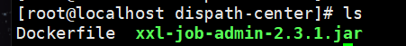
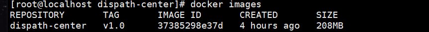
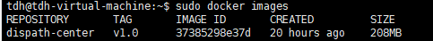

如果不是root用户，记得在命令前加sudo

### 1、编写Dockerfile

	FROM anapsix/alpine-java:8_server-jre_unlimited
	
	MAINTAINER LKT
	
	RUN mkdir -p /app/server/logs /app/server/config
	
	WORKDIR /app/server
	
	ENV SERVER_PORT=8080
	
	EXPOSE ${SERVER_PORT}
	
	ADD xxl-job-admin-2.3.1.jar app.jar
	
	ENTRYPOINT ["java", "-Dserver.port=${SERVER_PORT}","-jar", "app.jar","--spring.config.location=/app/server/config/application.yml"]

所有的Dockerfile里暴露的端口号要和配置文件里的server.port对应，且配置文件里server.port的值不能修改。

jar包和Dockerfile文件放同一文件夹下

### 2、 docker build -t 名字  （注意最后是一个点）

docker build -t dispath-center:v1.0 .

验证：docker images

### 3、导出tar包

docker save -o dispath-center.tar dispath-center:v1.0

现在这个tar包就可以用了

### 4、导入tar包

docker load -i dispath-center.tar

### 5、创建新容器

-p 端口映射

-v 文件夹挂载

-name 容器名

-d 后台启动

	docker run -d -p 9012:8080 --name dispath-center -v /app/srzf/test/logs:/app/server/logs -v /app/srzf/test/config:/app/server/config  dispath-center:v1.0

### 其他docker命令

删除镜像：docker rmi 镜像名

删除容器：docker rm 容器名

运行容器：docker run -p 9012:8080 --name dispath-center -v /app/srzf/test/logs:/app/server/logs -v /app/srzf/test/config:/app/server/config  dispath-center:v1.0

后台运行容器：docker run -d [image] [command]

启动容器：docker start [container]

停止容器：docker stop [container]

重启容器：docker restart [container]