### 安装docker
省略安装docker的教程

#### 安装好需要进行额外配置
在/etc/systemd/system/docker.service.d下创建docker.conf（记得加上权限）

```
[Service]
ExecStart=
ExecStart=/usr/bin/dockerd --default-ulimit nofile=65535:65535 -H tcp://0.0.0.0:2375 -H unix://var/run/docker.sock
```

--default-ulimit nofile=65535:65535 用来设置nofile的默认值(太大太小都会导致docker启动jar包失败)

-H tcp://0.0.0.0:2375 -H unix://var/run/docker.sock 用来实现docker的远程连接

#### 重启

systemctl daemon-reload

systemctl restart docker
### 安装docker-compose
https://github.com/docker/compose/releases/tag/v2.24.0

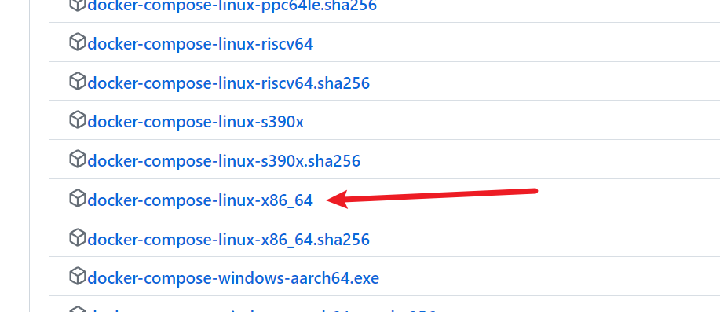

 上传到/usr/local/bin ，修改对应名字

    mv docker-compose-linux-x86_64 docker-compose


 安装成功

docker-compose --version


### 安装harbor

安装包下载地址：https://github.com/goharbor/harbor/releases/tag/v2.5.2

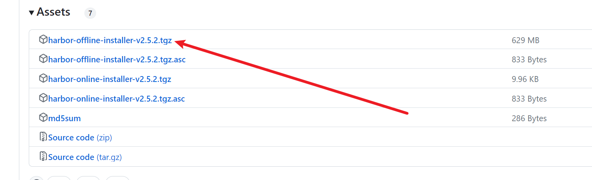

解压安装包

	tar -zxvf harbor-offline-installer-v2.5.2.tgz

修改配置文件

	cp harbor.yml.tmpl harbor.yml
	vi harbor.yml

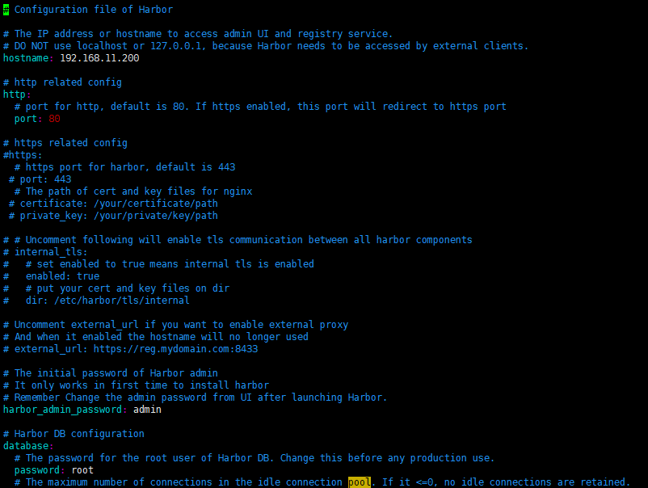

在有网的docker上拉取goharbor/prepare:v2.5.2镜像，导入到离线的docker上

	docker pull goharbor/prepare:v2.5.2
	docker save -o prepare.tar goharbor/prepare:v2.5.2
	docker load -i prepare.tar

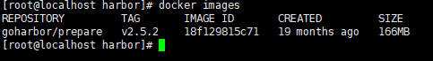

初始化

	./prepare

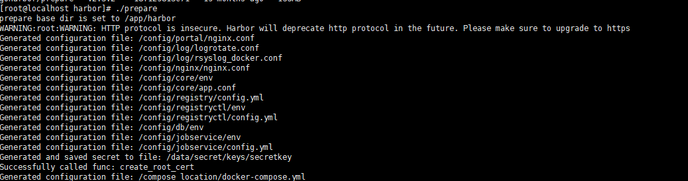

安装

	./install.sh

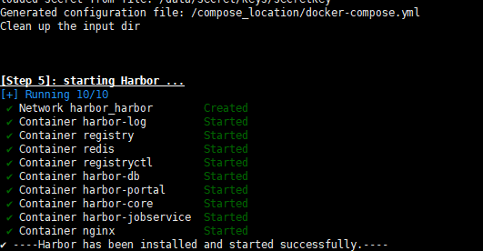

新建harbor.service

```
vi /lib/systemd/system/harbor.service
```
```
[Unit]
Description=Harbor
After=docker.service systemd-networkd.service systemd-resolved.service Requires=docker.service
Documentation=http://github.com/vmware/harbor ​
[Service]
Type=simple
Restart=on-failure
RestartSec=5
ExecStart=/usr/bin/docker-compose -f /usr/local/harbor/docker-compose.yml up ExecStop=/usr/bin/docker-compose -f /usr/local/harbor/docker-compose.yml down ​
[Install]
WantedBy=multi-user.target
```
添加权限


	chmod 777 /lib/systemd/system/harbor.service

启动

	systemctl start harbor.service

访问配置文件里配置的ip

http://192.168.11.200:80


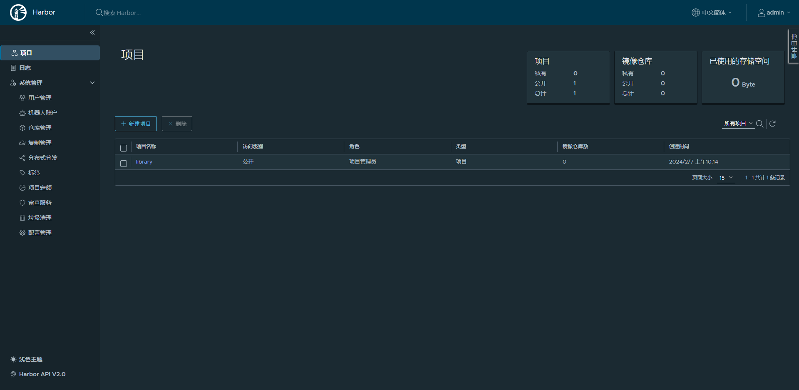


### docker推送镜像到私有仓库

#### 配置私有仓库地址

```
vi /etc/docker/daemon.json
```
```
{
  "registry-mirrors": ["http://192.168.11.200"],
  "insecure-registries":["192.168.11.200"]
}
```

重启服务

```
systemctl daemon-reload
systemctl restart docker
systemctl status docker
docker login 192.168.11.200  # 私有仓库的ip或域名，输入用户名、密码
```

#### 推送镜像


在项目中标记镜像：

	docker tag SOURCE_IMAGE[:TAG] 192.168.11.200/library/REPOSITORY[:TAG]

推送镜像到当前项目：

	docker push 192.168.11.200/library/REPOSITORY[:TAG]

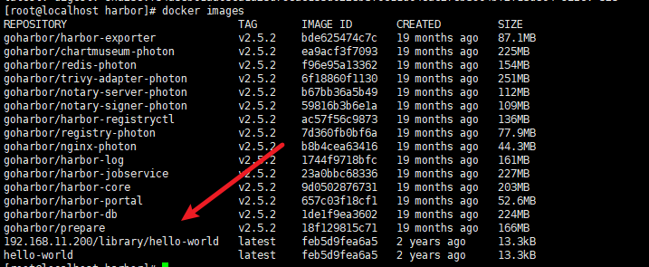

推送成功


### 安装idea插件

下载地址：https://plugins.jetbrains.com/plugin/7724-docker/versions/stable

根据版本进行下载

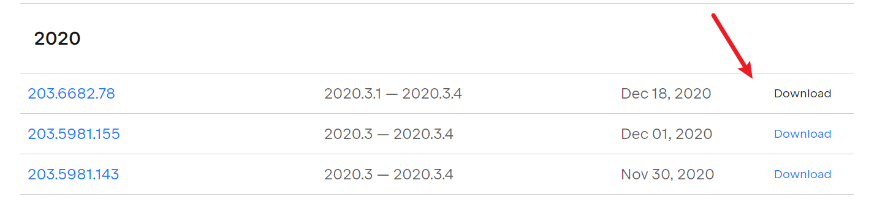

选择下载好的zip包，重启idea


配置docker源

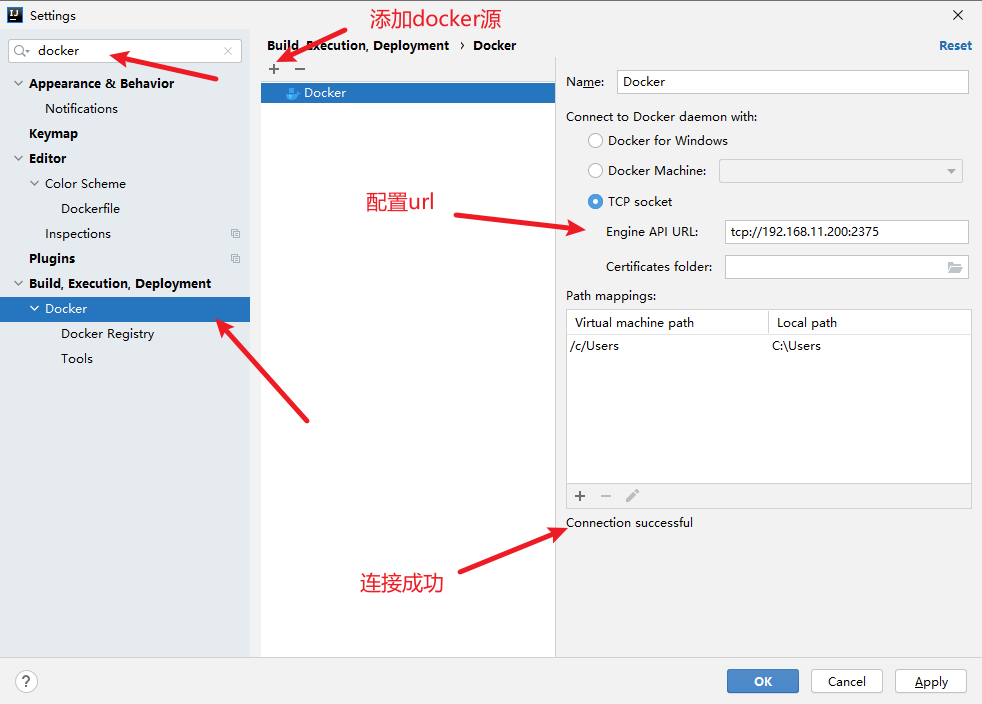

在项目中创建好Dockerfile文件

```
FROM 192.168.11.200/library/anapsix/alpine-java@sha256:d97f12170501e5faea7f86f9a9205d05f5cadcf7fb34fb53c3a7cef893e9cdd9

MAINTAINER LKT

RUN mkdir -p /app/server/logs /app/server/config

WORKDIR /app/server

ENV OPT=""

ENV JAVA_ARGS=""

ADD ./target/data-api-service-1.0-SNAPSHOT.jar app.jar

ENTRYPOINT ["sh","-c","java $OPT -XX:SurvivorRatio=4  -XX:+UseConcMarkSweepGC -XX:+UseCMSCompactAtFullCollection -XX:CMSInitiatingOccupancyFraction=60 -XX:+PrintGCDateStamps -Xdebug -DLOG_HOME=/app/server/logs -Xloggc:/app/server/logs/gc.log -jar app.jar --spring.config.location=/app/server/config/ $JAVA_ARGS"]
```

新建Dockerfile的配置

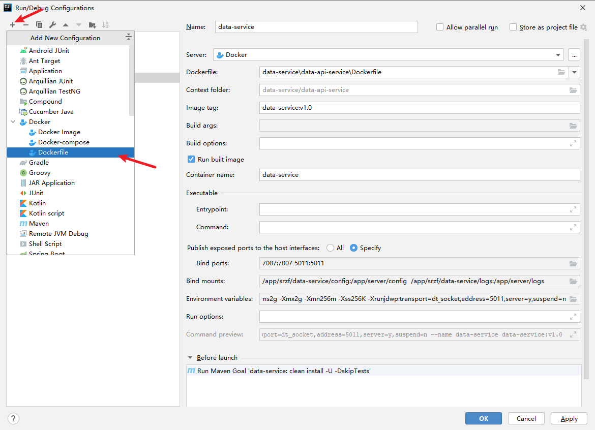

DockerFIle配置

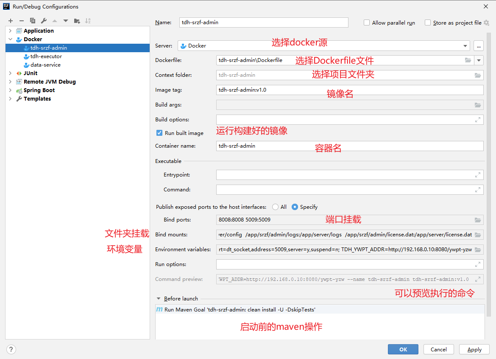

配置成功

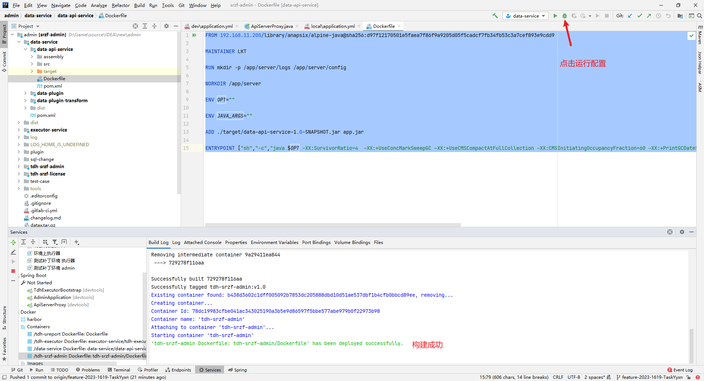
