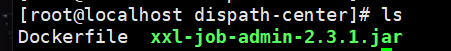
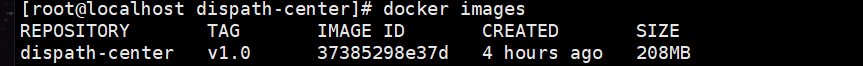
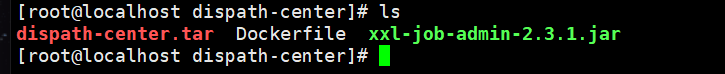
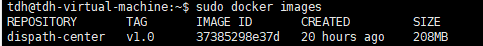
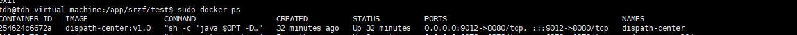

如果不是root用户，记得在命令前加sudo

### 1、编写Dockerfile

    FROM anapsix/alpine-java:8_server-jre_unlimited

    MAINTAINER LKT
    
    RUN mkdir -p /app/server/logs /app/server/config
    
    WORKDIR /app/server
    
    ENV OPT=""
    
    ENV JAVA_ARGS=""

    ADD xxl-job-admin-2.3.1.jar app.jar

    ENTRYPOINT ["sh","-c","java $OPT -DLOG_HOME=/app/server/logs -Xloggc:/app/server/logs/gc.log -jar app.jar --spring.config.location=/app/server/config/ $JAVA_ARGS"]


jar包和Dockerfile文件放同一文件夹下




### 2、 docker build -t 名字  <font color= "red">（注意最后是一个点）</font>

docker build -t dispath-center:v1.0 .

验证：docker images

### 3、导出tar包

docker save -o dispath-center.tar dispath-center:v1.0



现在这个tar包就可以用了

### 4、导入tar包

docker load -i dispath-center.tar



### 5、创建新容器

-p 宿主机端口:容器端口

-v 宿主机文件夹:容器文件夹

-name 容器名

-d 后台启动

-e 环境变量

例子

```
docker run -d -p 9012:8080 -e OPT="-server -Xms2g -Xmx8g -Xmn256m -Xss256K -XX:SurvivorRatio=4 -Xdebug -Xrunjdwp:transport=dt_socket,address=6009,server=y,suspend=n" -e JAVA_ARGS="" --name dispath-center -v /app/srzf/test/logs:/app/server/logs -v /app/srzf/test/config:/app/server/config  dispath-center:v1.0
```



### 其他docker命令

删除镜像：docker rmi  [image]

删除容器：docker rm  [command]

运行容器：docker run [image] [command]

后台运行容器：docker run -d [image] [command]

启动容器：docker start [container]

停止容器：docker stop [container]

重启容器：docker restart [container]

进入容器：docker exec -it [container] /bin/bash