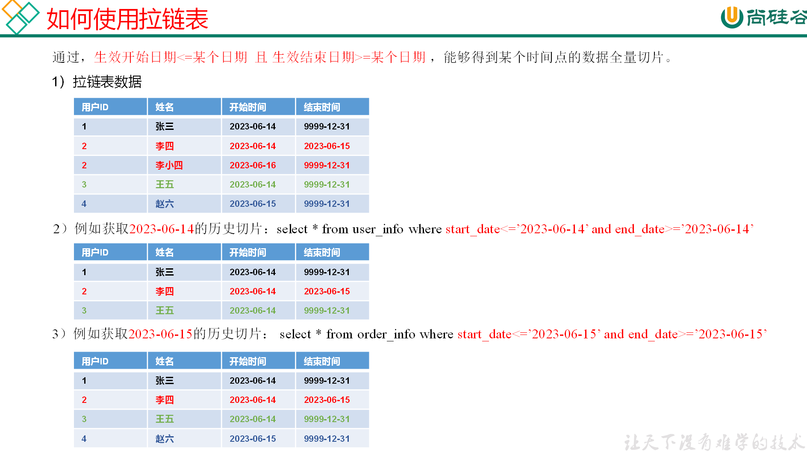

#### 反映历史变化
数据仓库通常需要保存历史数据，通常有两种做法，分别是全量快照法和拉链表法。

#### 全量快照法
离线数据仓库的计算周期通常为每天一次，所以可以每天保存一份全量的维度数据。这种方式的优点和缺点都很明显。

优点是简单而有效，开发和维护成本低，且方便理解和使用。

缺点是浪费存储空间，尤其是当数据的变化比例比较低时。

#### 拉链表法
拉链表的意义就在于能够更加高效的保存维度信息的历史状态。

