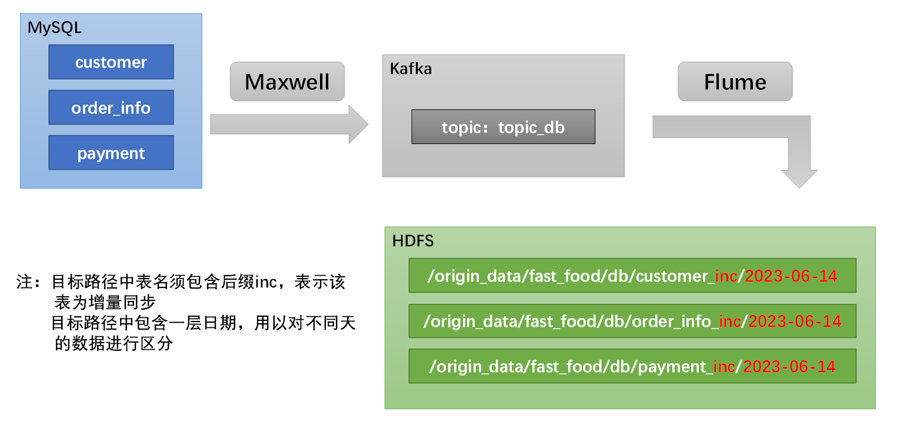

#### 增量的流程

MaxWell监听Mysql的binlog,把变更的数据发给Kafka,Kafka发给Flume再发给hadoop存起来

#####  1、Kafka作为消息队列在其中的作用是：
让生产者消费者都能正常发送和处理消息

**（1）解耦**：生产者和消费者不需要直接相互通信或知道彼此的存在。生产者只需要将消息发送到队列，而消费者只需要从队列中拉取消息。这允许系统组件独立地扩展、升级或替换，而不会影响到其他组件。

**（2）缓冲和存储**：消息队列可以暂存大量消息，直到消费者准备好处理它们。这允许生产者和消费者在不同的速率下工作，因为队列会自动调节它们之间的速度差异。此外，队列还提供了持久化机制，确保即使系统崩溃，消息也不会丢失。

**（3）异步处理**：通过将消息发送到队列，生产者可以立即继续处理其他任务，而不必等待消费者完成处理。这提高了系统的整体吞吐量和响应速度。

**（4）负载均衡**：消息队列可以将消息分发到多个消费者，从而实现负载均衡。这有助于优化资源利用，确保系统在高负载下仍能保持良好的性能。

**（5）容错性**：消息队列通常具有容错机制，如消息确认、持久化和复制。这确保了在系统出现故障时，消息不会丢失，并且可以重新发送或恢复处理。

#####  2、Flume在其中的作用是：

**（1）数据采集**：Flume可以接收、汇总MaxWell的数据

**（2）数据存储**：Flume可以将处理过的数据存储到各种数据存储系统中，如Hadoop、HBase等，实现数据的持久化和存储。

**（3）数据处理**：包括数据清洗、实时监控和分析数据，保证数据质量和准确性。

