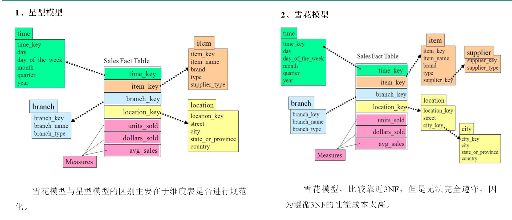

星型模型对于多层次的维度，会有数据冗余，查询性能好、方便。

#### 多值维度
如果事实表中一条记录在某个维度表中有多条记录与之对应，称为多值维度。例如，下单事实表中的一条记录为一个订单，一个订单可能包含多个商品，所以商品维度表中就可能有多条数据与之对应。
针对这种情况，通常采用以下两种方案解决。

第一种：降低事实表的粒度，例如将订单事实表的粒度由一个订单降低为一个订单中的一个商品项。

第二种：在事实表中采用多字段保存多个维度值，每个字段保存一个维度id。这种方案只适用于多值维度个数固定的情况。
建议尽量采用第一种方案解决多值维度问题。

